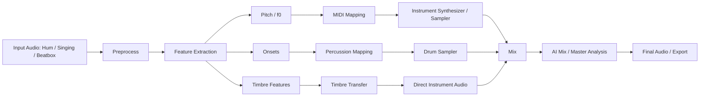
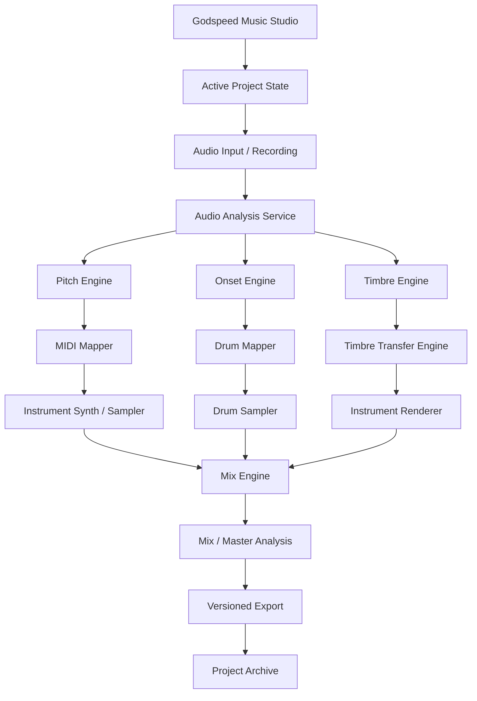

# GODSPEED MUSIC STUDIO — AI VOICE TO INSTRUMENT BLUEPRINT

## Purpose

Canonical research and technical blueprint for adding AI audio capabilities to Godspeed Music Studio. This document describes existing approaches and a build path for hum, singing, and beatbox to MIDI or realistic instrument audio, followed by mixing and mastering.

## Capability Landscape

| Capability | Example approach | Output | Core technology |
|---|---|---|---|
| Voice / hum / beatbox to MIDI | Dubler 2 | MIDI notes and control | Pitch and percussion detection |
| Voice / hum to MIDI | Imitone | MIDI | Pitch tracking and formant analysis |
| Audio to MIDI | Melodyne | Notes / MIDI | Polyphonic pitch analysis |
| Audio to MIDI | Spotify Basic Pitch | MIDI | Neural audio transcription |
| Hum / whistle / beatbox to instrument | Google Tone Transfer | Instrument audio | DDSP |
| Timbre transfer | Magenta DDSP | Instrument-like audio | Neural synthesis / DSP |
| Voice to guitar / drums | Specialized timbre-transfer systems | Instrument audio | Neural timbre transfer |
| Beatbox to drums | Beatbox-to-MIDI systems | Drum MIDI | Onset and spectral classification |

These are reference capabilities, not claims that these third-party systems are currently integrated into APEX.

## AI Mixing and Mastering Reference Layer

Potential reference approaches include AI-assisted mastering and mixing systems such as LANDR, iZotope Ozone, eMastered, CloudBounce, BandLab Mastering, and Neutron. Integration must be treated as an adapter and must not imply a provider is connected until the connection is actually verified.

## Signal Processing Science

### Pitch detection

Autocorrelation can estimate the fundamental period:

`R(tau) = sum[x(n) * x(n - tau)]`

The lag with the strongest relevant correlation estimates the fundamental period. With sample rate `fs`:

`f0 = fs / tau`

Production implementation may use YIN, aubio, Basic Pitch, or another validated pitch estimator depending on latency and polyphony requirements.

### Onset detection

Spectral flux can detect changes associated with percussion onsets:

`SF(t) = sum H(|X(t,k)| - |X(t-1,k)|)`

where `X(t,k)` is the STFT representation and `H` is the positive-half-wave function.

### Timbre transfer

A neural or DDSP-style system can separate pitch and excitation information from timbral characteristics and synthesize an instrument-like output. A practical implementation should begin with pretrained models or samplers before considering custom training.

## Canonical Godspeed Pipeline

## Godspeed Studio Integration

The capability belongs inside the existing one-tab Music Studio. It should operate on the active project and preserve the established asset lifecycle:

`VOCALS/RAW -> CLEAN -> BEATS/STEMS -> MIXING/PRESETS -> PROJECTS -> EXPORTS -> 7TB_ARCHIVE`

### Required user workflow

1. Record or import a vocal, hum, singing performance, or beatbox.
2. Preserve the original RAW asset unchanged.
3. Analyze pitch, timing, onsets, and timbre.
4. Let the user choose MIDI conversion, drum mapping, sampled instrument rendering, or neural timbre transfer.
5. Render a new derived asset rather than overwriting the source.
6. Place the derived instrument or MIDI performance into the active project timeline.
7. Allow normal mixing controls.
8. Run optional AI mix/master analysis.
9. Compare before and after.
10. Export a new version and preserve provenance.

## Architecture

## Implementation Strategy

### Phase 1 — Practical integration

Use existing open-source or locally executable audio analysis where appropriate:

- librosa for analysis utilities
- aubio or YIN-style pitch detection
- Spotify Basic Pitch for audio-to-MIDI where appropriate
- FFmpeg for reliable audio conversion and rendering
- Existing sampler or instrument engine for realistic instrument output

### Phase 2 — Neural instrument rendering

Add a controlled DDSP or comparable model adapter. The adapter should accept a normalized feature representation and return a derived audio asset. Model selection must be configurable and replaceable.

### Phase 3 — Custom models

Only after the pipeline is proven should APEX consider fine-tuning or training specialized models for instruments such as saxophone, trumpet, guitar, piano, strings, or drums.

## Security and Provenance

- Never expose provider credentials to the browser or AI chat.
- Keep credentials behind the existing Vault / Gatekeeper boundary.
- Treat external AI audio services as replaceable adapters.
- Store model name, model version, processing parameters, source asset ID, output asset ID, and processing timestamp.
- Preserve the original RAW recording.
- Record user-approved AI operations.
- Never report a feature as connected or verified until an actual test succeeds.

## Performance Requirements

Audio processing should run as a background job when the operation is expensive. The UI should show real job state rather than a fabricated progress indicator. Large audio files should not all be loaded into browser memory simultaneously.

## Acceptance Tests

- Import a real vocal or hum recording.
- Preserve the original RAW file.
- Detect pitch on a supported monophonic input.
- Detect beatbox/percussion on supported input.
- Generate MIDI or instrument audio as selected.
- Insert the result into the active project.
- Play the derived result in the timeline.
- Mix the derived track with other project tracks.
- Create a new version without overwriting the source.
- Export the result.
- Record provenance and processing metadata.
- Verify failure handling when an engine or model is unavailable.

## Status

**Research specification / implementation blueprint.**

This document does not claim that voice-to-instrument, AI mastering, DDSP, Basic Pitch, or any other third-party capability is already live in APEX. Implementation status must be established by repository and runtime verification.
