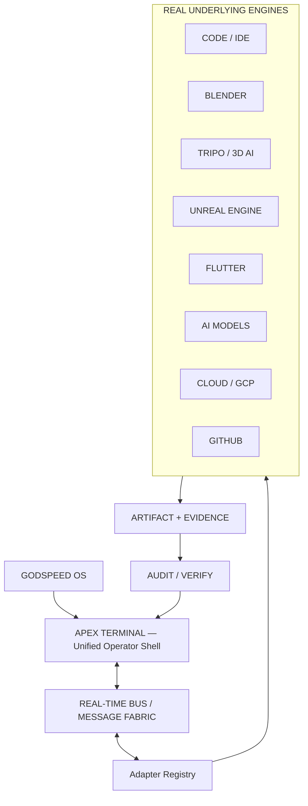
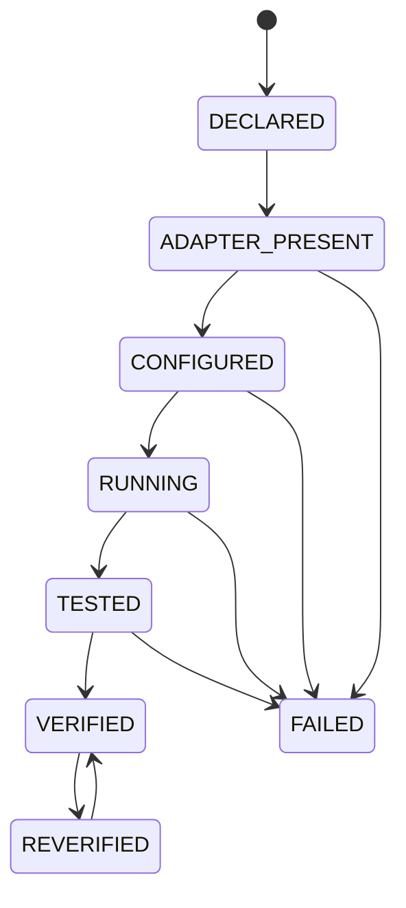
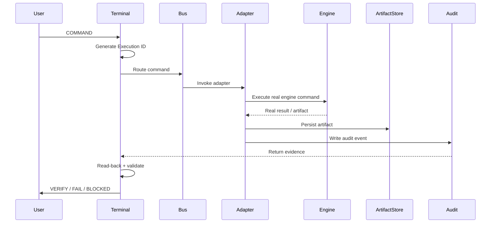

# GODSPEED Unified Workstation

## Engine Specification v1.0 — 3D / 4K / Real-Time / Verification

**Status:** SPECIFICATION ONLY — RUNTIME UNVERIFIED  
**Core loop:** REMEMBER → REBUILD → REBOOT → VERIFY  
**Rule:** NO FAKE GREEN

> This document defines the intended engine contract. It is not evidence that any capability is currently running. A capability becomes verified only after executable evidence and read-back verification exist.

---

## 0. Honest Status

Capability lifecycle:

```text
DECLARED
↓
ADAPTER PRESENT
↓
CONFIGURED
↓
RUNNING
↓
TESTED
↓
VERIFIED
```

Failure states may occur at any stage. Runtime claims must be derived from evidence, never from configuration declarations alone.

---

## 1. Core Operating Loop


The workstation does not stop at "built" or "launched." A successful operation requires artifact read-back and verification appropriate to the operation.

---

## 2. Top-Level Architecture



APEX Terminal coordinates real underlying tools through adapters. It must not represent an unconnected or simulated specialist engine as operational.

---

## 3. Capability Lifecycle



Every capability/tab carries an honest lifecycle state.

Examples:

| Capability | Verification example |
|---|---|
| Blender | Real scene operation completes and a real frame is read back |
| Unreal | Real 4K frame/sequence is produced and verified |
| Flutter | UI shell builds and runs with runtime evidence |
| Tripo | Real mesh-generation call succeeds and result is read back |
| GitHub | Repository operation succeeds and commit/read-back is confirmed |

---

## 4. Command Execution Pipeline



---

# 5. 3D / 4K Engine Science

## 5.1 Resolution

Default production target:

```text
Primary: 3840 × 2160 UHD 4K
DCI 4K: 4096 × 2160
Chroma: 4:4:4 where the selected format supports it
Bit depth: 10-bit minimum for the HDR production path
HDR: PQ or HLG where the delivery target requires it
Color: Rec.2020 / Rec.709 according to target
```

If an operation explicitly targets 8K:

```text
7680 × 4320
```

The engine must store the selected target in execution metadata rather than treating "4K" as an implicit universal setting.

## 5.2 3D Rendering

For a closed manifold mesh:

```text
V - E + F = 2
```

The workstation should surface geometry validation where applicable, including malformed topology, normals, UV problems and invalid asset state.

Expected PBR material inputs may include:

- Albedo/base color
- Normal
- Roughness
- Metallic
- Optional displacement/height

The rendering layer should support modern physically based workflows including microfacet BRDFs, Fresnel handling, importance sampling and HDR environment lighting through the underlying engine rather than attempting to replace the renderer in the shell.

Fresnel Schlick approximation:

```text
F = F0 + (1 - F0)(1 - cos θ)^5
```

## 5.3 GPU Frame Budget

For 60 FPS:

```text
1 / 60 = 16.67 ms per frame
```

For 30 FPS:

```text
1 / 30 = 33.33 ms per frame
```

A capability is real-time for a target only when measured execution/frame timing meets the declared target under the defined test conditions.

## 5.4 Frame Memory Estimate

For a 3840 × 2160 RGBA frame represented using 2 bytes per channel:

```text
3840 × 2160 × 4 × 2 ≈ 66.4 MB
```

Actual production VRAM requirements depend on engine, render targets, textures, geometry, acceleration structures and effects. Hardware recommendations must therefore be measured against the actual workload rather than treated as a universal guarantee.

## 5.5 Video / 4K Encoding

Render format and delivery format are separate concerns.

A verified 4K export records, where applicable:

- resolution
- codec
- bit depth
- chroma subsampling
- color space
- container
- duration
- frame count
- frame rate
- file size
- artifact hash

Bitrate is recorded from the actual encoded artifact; the engine must not claim a bitrate solely from a preset name.

---

# 6. Real Engine Adapters

| Adapter | Purpose | Example outputs/evidence |
|---|---|---|
| Blender | Scene setup, asset creation, rendering | `.blend`, `.fbx`, `.gltf`, `.exr`, `.png`, render logs |
| Tripo / 3D provider | AI-assisted 3D generation | generated mesh, source/reference, provider job ID |
| Unreal Engine | Real-time rendering, world/build workflows | project artifacts, frame/sequence, package, logs |
| Flutter | Cross-platform workstation UI | web build, APK/IPA where applicable, runtime logs |
| AI models | Code, reasoning, generation, enhancement | model/provider/version, prompt/reference, output hash |
| Cloud/GCP | Jobs, storage, deployment infrastructure | job ID, logs, object reference, deployment evidence |
| GitHub | Source control and CI/CD | commit SHA, workflow run, diff/read-back |

---

# 7. Verification Math and Evidence

An artifact is verified only when the applicable conditions are true:

```text
VERIFY =
  artifact exists
AND engine returned success
AND recorded SHA-256 matches artifact bytes
AND metadata matches expected target
AND read-back succeeds
```

## 7.1 Hash Verification

```text
SHA-256(artifact bytes) → 64-character hexadecimal digest
```

The digest is recorded as evidence and compared after storage/transfer when integrity verification is required.

## 7.2 Visual Frame Verification

Perceptual hashes may supplement cryptographic hashes for visual comparison:

```text
pHash(frame) → perceptual fingerprint
```

Use this to detect unexpected visual changes such as missing/black frames, repeated frames or ordering problems. A pHash comparison is not a substitute for SHA-256 integrity verification.

## 7.3 Timing Verification

```text
measured_render_time ≤ declared_frame_budget
```

The test record must include hardware, scene/workload, resolution, quality settings and target FPS so that "real-time" has a defined meaning.

---

# 8. Truth Gate Integration

Every engine result enters the verification pipeline:

```text
ENGINE RESULT
↓
ARTIFACT
↓
METADATA
↓
HASH
↓
READ-BACK
↓
AUDIT EVENT
↓
EVIDENCE
↓
VERIFIED / UNVERIFIED / FAILED / BLOCKED
```

No manual "mark complete" action may bypass the evidence chain.

---

# 9. Acceptance Criteria

The Unified Workstation is globally **VERIFIED** only when all required production capabilities have executable evidence for the release scope, including:

- APEX Terminal loads with layered navigation.
- Real-time bus routes commands.
- Adapter lifecycle states are tracked.
- Blender adapter produces and reads back a real render.
- Unreal adapter produces and reads back a real 4K frame or sequence for the declared test target.
- Flutter adapter builds a runnable shell.
- GitHub adapter proves repository read/write/read-back behavior appropriate to the operation.
- Cloud adapter proves a real job or storage operation.
- Truth Gate records evidence.
- SHA-256 verification passes for required artifacts.
- Audit feed contains execution IDs, timestamps, states and results.

If any required capability lacks evidence:

```text
GODSPEED UNIFIED WORKSTATION
STATUS: UNVERIFIED
```

---

# 10. First Adapter Acceptance Test

The first executable proof target is deliberately small:

```text
Blender Adapter
→ create cube
→ configure 3840×2160 render
→ render PNG
→ persist artifact
→ SHA-256 artifact
→ read artifact back
→ recompute SHA-256
→ compare hashes
→ record execution/audit evidence
→ Truth Gate result
```

Expected result if all checks pass:

```text
Blender Adapter
STATUS: VERIFIED
```

If any check fails:

```text
Blender Adapter
STATUS: FAILED / BLOCKED / UNVERIFIED
```

Never mark the capability green from UI state alone.

---

# 11. Implementation Rule While Additional Specifications Arrive

This document is a baseline, not permission to prematurely implement conflicting architecture.

While additional source material is being supplied:

1. Preserve existing backend/frontend/AI/payment/database/terminal architecture.
2. Add specifications without deleting prior requirements.
3. Resolve conflicts by explicit audit and evidence, not assumption.
4. Do not start irreversible migrations from specification text alone.
5. Keep all untested capabilities `UNVERIFIED`.
6. Once the specification set is complete, produce an implementation map before modifying runtime code.

**Locked loop:**

```text
REMEMBER → REBUILD → REBOOT → VERIFY
```
